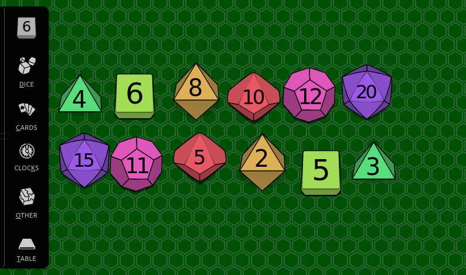

# Togetherness Table

**A virtual and liberated tabletop**

[](https://circleci.com/gh/sjbrown/togetherness)

| [Live Demo](#live-demo) | [Quick Start](#quick-start) | [Goals](#goals) |

Tabletop RPGs are no longer just played in physical spaces. More and more,
this kind of game is being played online, and players are
discovering online dice rollers, communal game maps, virtual tabletops,
and digital character keepers. But too often these tools are walled
gardens whose owners see players as *products*, not human beings.



Togetherness Table is a web-based virtual tabletop whose chief aim is
the empowerment of players as free human beings participating voluntarily
in a community. There are no "owners", just equal participants enjoying a
gamut of activities including "creation", "play" and "hosting".

## Goals

Togetherness Table aims to be
[Local-First Software](https://www.inkandswitch.com/local-first.html)

 * No spinners: your work at your fingertips
 * Your work is not trapped on one device
 * The network is optional
 * Seamless collaboration with your colleagues
 * Survival post-demise
 * Security and privacy by default
 * You retain ultimate ownership and control

Furthermore, Togetherness Table should:

 * Be document-centric. The state should all live in the document. Let
   creators treat their game state like documents they can save to disk,
   edit in Inkscape, and use their own SVG-editing workflows in the way
   they feel most comfortable and productive.
 * Use HTML5. Use SVG.
   * Don't reinvent wheels that already exist
   * Use the opportunity to deeply learn the standards
   * Leverage other contributors' knowledge of the standards
 * Not require special server-side software
   * No software to install, no security concerns, no dependency hell.
     A contributor should have to do nothing more than run a single command
     then open up their web browser.
   * Easy to fork.  If someone wants to add Togetherness Table as a widget
     on a website they host, that should be possible.

# Live Demo

I'm going to try to keep a demo up and running at
[https://www.1kfa.com/table](https://www.1kfa.com/table)

# Quick Start

```bash
git clone <this repo>
cd togetherness/src
python3 -m http.server

# Or,if you prefer,
# python2 -m SimpleHTTPServer 8000
# Or if you prefer Node.js to Python:
# npm install npx -g; npx http-server -a localhost -p 8000
```

Then open your browser to [localhost:8000](http://localhost:8000/)

That's it!

# Making your own "objects" for the table

Any interactive objects (dice, decks of cards, etc) are simply SVG files.

Click on `+ Other` and then `+ SVG File` and you can paste in an SVG
file.  Ensure the "Allow JavaScript" option is selected.

## Interactivity Interface

To make your object interactive, you need to include some JavaScript.

Your `<script>` element needs to have an attribute `data-namespace`
with a name that's unique to your object.

Inside the script, there must be one JavaScript object whose name
matches that `data-namespace` value. This object uses a specially-named
key, "menu", to integrate with the main web UI:


```xml
<svg x="0" y="0" width="100" height="100">
  <!-- This is a red rectangle.
       It has a context menu.
       A context menu option will allow the user to change it to green.
  -->
  <rect x="25" y="25" width="50" height="50" style="fill:#ff0000" />
  <script
    type="text/javascript"
    data-namespace="myThing"
  ><![CDATA[

myThing = {

  menu: {
    'Change Color': {
      eventName: 'changeMyColor',
      applicable: (elem) => { return true },
      uiLabel: (elem) => { return 'Change Color To Green' },
      handler: function(evt) {
        // Note - "handler" must be written as a traditional function,
        // not an arrow-function, so that "this" is bound correctly
        console.log('Changing color!')
        this.querySelector('rect').style['fill'] = '#00ff00'
      },
    },
  },

}

]]></script>
</svg>
```

That's it!

## Developers: Permanently adding objects

If you've forked this repo and want to make your interactive objects
permanent, you can do the following:

First, add a `+ My Thing` button to the `index.html` file.

```
<button class="btn" onclick="add_object('svg/v1/my_thing.svg')">
 + My Thing
</button>
```

Then just add the file `svg/v1/my_thing.svg`.

## History

After joining The Gauntlet and playing around with the awesome
[roller](https://github.com/shanel/roller),
I got the itch to create my own "dice-rolling" application.

