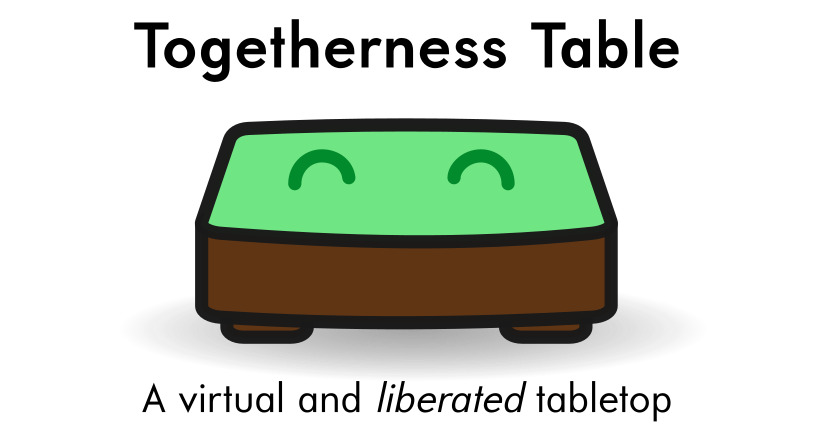

# Togetherness Table

| [Live Demo](#live-demo) | [Quick Start](#quick-start) | [Goals](#goals) |

## Mission

Tabletop games are no longer just played in physical spaces. More and more,
this kind of game is being played online, and players are
using online dice rollers, communal game maps, virtual tabletops,
and digital character keepers. But too often these tools are walled
gardens whose owners see players as *products*, not human beings.

Any of the closed-source for-profit offerings are destined
to become tools of the [Surveillance Economy](https://duckduckgo.com?q=the%20surveillance%20economy) and components of a the larger machine
whose aim is not freedom and play, but the manufacture of consent.

Togetherness Table is a web-based virtual tabletop whose chief aim is
the empowerment of players as free human beings participating voluntarily
in a community. There are no "owners", just equal participants enjoying a
gamut of activities including "creation", "play" and "hosting".

## Features

With Togetherness Table, multiple users can manipulate "toys", draw and
edit shapes, and create rules and behaviours in a shared SVG document
that syncs in real time using [Yjs](https://yjs.dev/) CRDTs over WebRTC.

No accounts. No servers storing your data. No surveillance. The document
lives in your browser and syncs peer-to-peer — the signaling server only
brokers WebRTC handshakes and never sees document content.

## Goals

Togetherness Table aims to be
[Local-First Software](https://www.inkandswitch.com/local-first.html)

 * No spinners: your work at your fingertips
 * Your work is not trapped on one device
 * The network is optional
 * Seamless collaboration with your colleagues
 * Survival post-demise
 * Security and privacy by default
 * You retain ultimate ownership and control

Furthermore, Togetherness Table should:

 * Point people toward the **Good** works done by thousands of international
   engineers over the past 50+ years
 * Be document-centric. The state should all live in the document. Let
   creators treat their game state like documents they can save to disk,
   edit in Inkscape, and use their own SVG-editing workflows in the way
   they feel most comfortable and productive.
 * Use HTML5. Use SVG.
   * Don't reinvent wheels that already exist
   * Use the opportunity to deeply learn the standards
   * Leverage other contributors' knowledge of the standards
 * Not require special server-side software
   * No software to install, no security concerns, no dependency hell.
     A contributor should have to do nothing more than run a single command
     then open up their web browser.
   * Easy to fork.  If someone wants to add Togetherness Table as a widget
     on a website they host, that should be possible.

# Live Demo

I'm going to try to keep a demo up and running at
[https://www.1kfa.com/table](https://www.1kfa.com/table)


## Quick start

```bash
git clone <this repo>
cd togetherness/

# 2. Start dev environment
bin/dev.sh
```

Then open your browser to [http://localhost:3000](http://localhost:3000)

That's it!

Open the app in two browser windows with the same URL hash (e.g. `http://localhost:3000/#my-room`) to see real-time sync.

## Testing

```bash
bin/test.sh              # unit tests + e2e tests
bin/test_unit.docker.sh  # unit tests only (Docker)
bin/test_e2e.docker.sh   # e2e tests only (Docker)
```

All tests run inside Docker containers — no local Node installation required.

There are two layers of tests:

- **Unit tests** — pure CRDT logic, no browser, no network. Sync is simulated with `Y.encodeStateAsUpdate` / `Y.applyUpdate`.
- **E2E tests** — Playwright tests against a full running stack (app + signaling server).


## Offline-first

Documents persist locally via `IndexeddbPersistence` — the app works without a network connection and syncs when peers reconnect. There is no canonical server copy of any document.


## History

After joining The Gauntlet and playing around with the awesome
[roller](https://github.com/shanel/roller),
I got the itch to create my own "dice-rolling" application.

